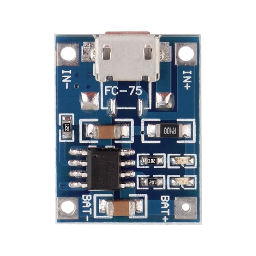

# 18650 battery charger

[<- Back](../../README.md)

### Pre requisites

- TC4056A (25x18x3)

### Charger case

### Description

Charger designed for 18650 3.7V type batteries.

Case print designs attached.
Recommend mount chips on hot glue to bottom part.
Top parts has slots for mounting battery holders.